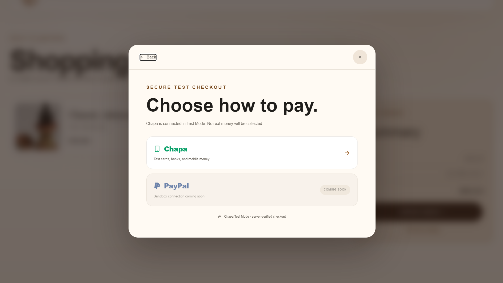
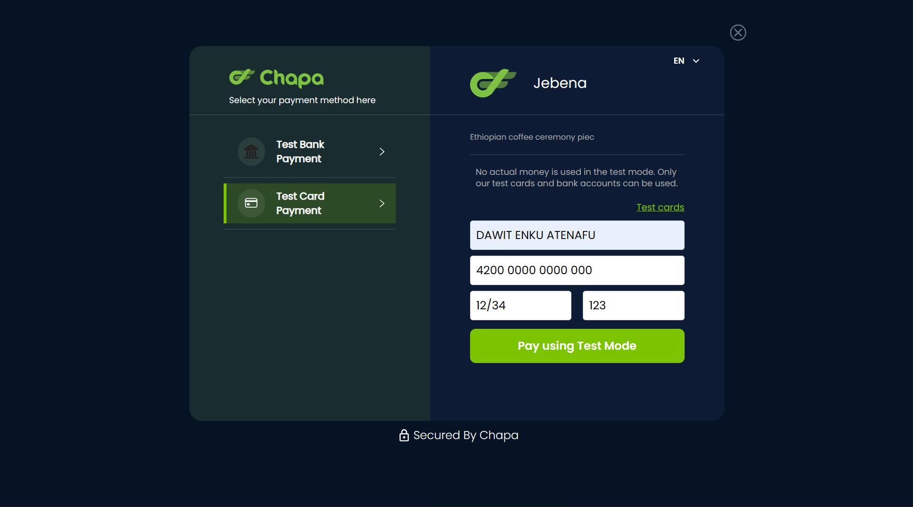
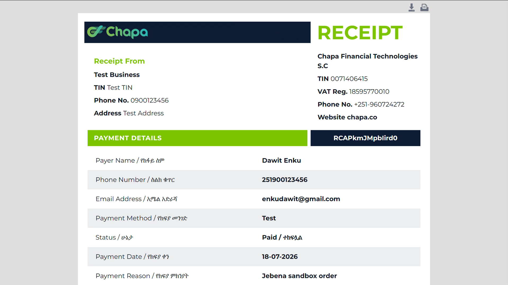

# Jebena

Jebena is a responsive Ethiopian coffee-culture storefront for handcrafted ceremony pieces. It includes mock product, search, filtering, customization, cart, and checkout experiences.

## Current payment status

- Chapa is connected in **Test Mode**. The app initializes checkout on Chapa and verifies the returned transaction through local server routes. No real money is collected.
- PayPal remains visible as **Coming soon** and is not connected yet.
- There is no database, user account system, or storage of customer payment details.

## Technology

- React 19 and TypeScript
- Vite with vinext routing
- Responsive HTML and CSS
- React Icons
- Chapa Test Mode API

## Run locally

### 1. Install the prerequisite

Install [Node.js](https://nodejs.org/) **22.13 or newer**. Node.js 20 cannot run this version of vinext.

Check the installed version:

```powershell
node --version
```

### 2. Install dependencies

Open PowerShell in this folder and run:

```powershell
npm install
```

### 3. Configure Chapa Test Mode

Keep the private test secret in a local `.env.local` file:

```dotenv
CHAPA_SECRET_KEY=your_test_secret_key
APP_URL=http://localhost:3000
```

Never paste the secret key into source code, this README, screenshots, or messages shared with other people. The current computer is already configured; this step is for a fresh setup.

### 4. Start the app

```powershell
npm run dev
```

Open [http://localhost:3000](http://localhost:3000). Stop the app at any time by returning to PowerShell and pressing `Ctrl+C`.

## Show it on another device

For a phone or computer on the **same Wi-Fi network**:

1. Run `npm run dev:network`.
2. Run `ipconfig` in another PowerShell window and find the computer's IPv4 address.
3. On the other device, open `http://YOUR-IPV4-ADDRESS:3000`.
4. If Windows asks, allow Node.js on **Private networks** only.

For Chapa's return page to work on that device, change `APP_URL` in `.env.local` to the same network address, for example `http://192.168.1.25:3000`, then restart the app.

This does not publish or deploy the project. It is reachable only while the command is running and, normally, only from the same local network. Showing it outside that network would require a separately authorized tunnel or hosting setup.

## Screenshots

| Storefront | Shopping experience |
| --- | --- |
|  |  |
|  |  |

## Future direction

Future versions may add PayPal Sandbox and interactive WebGL product presentation. Production payments must not be enabled until server-side validation, deployment secrets, webhook verification, order persistence, and security review are in place.
